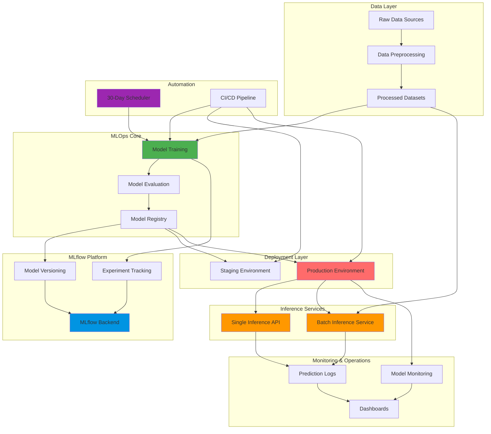
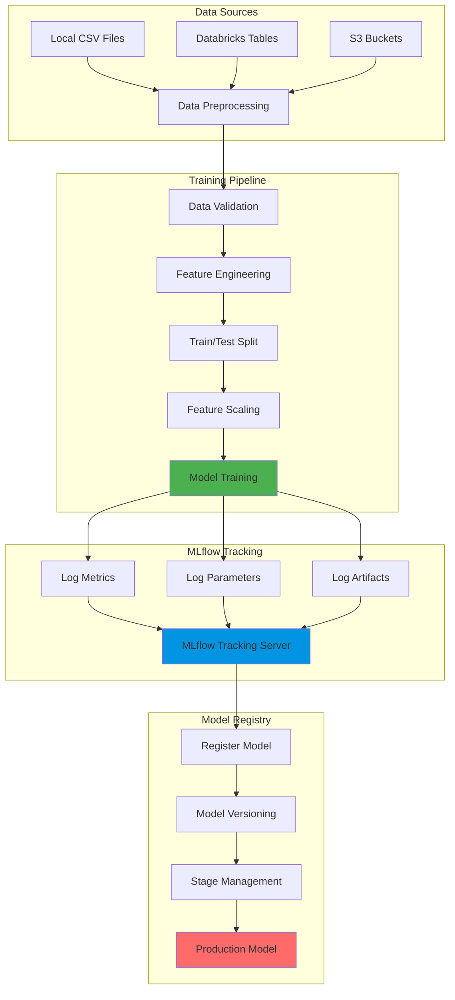
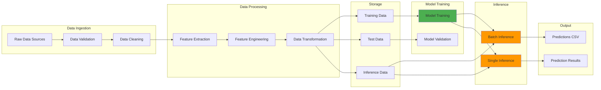
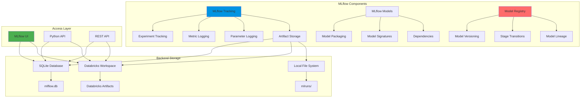
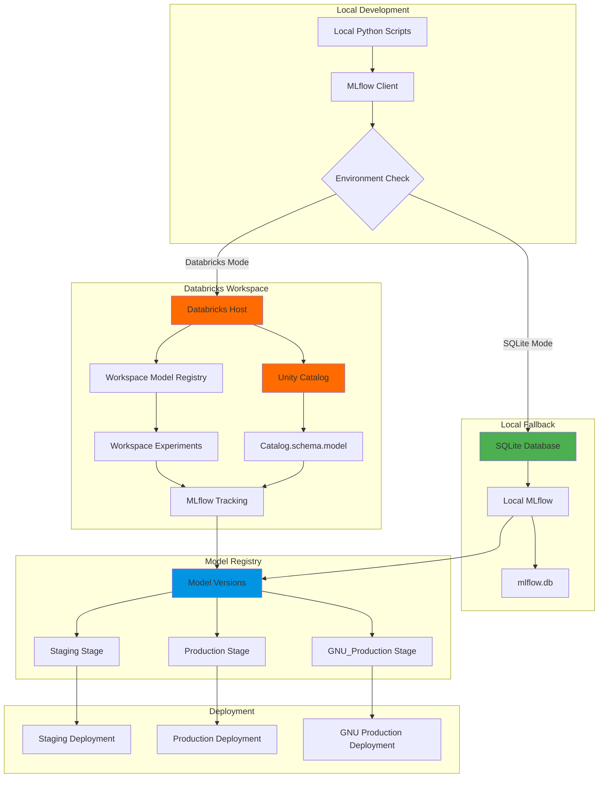
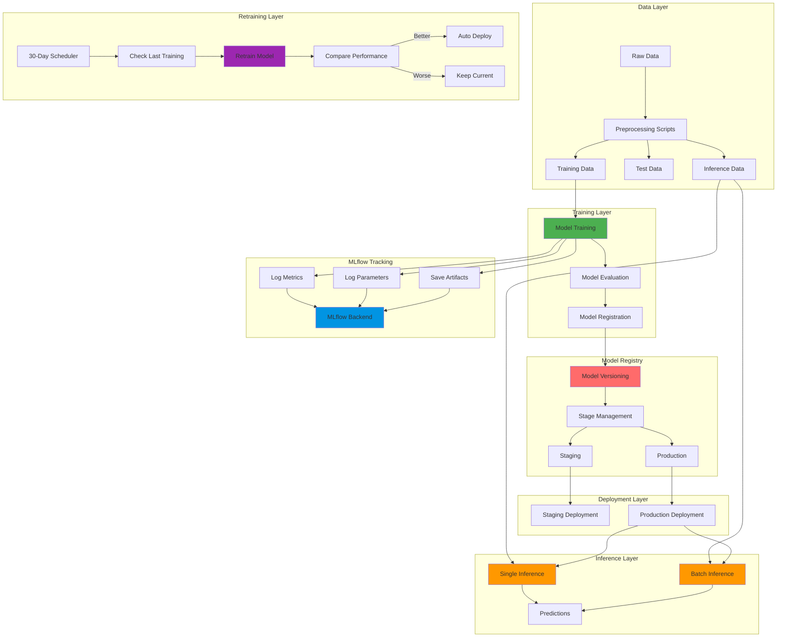
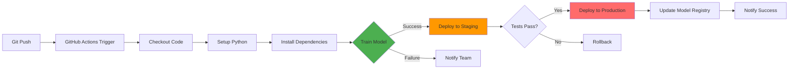
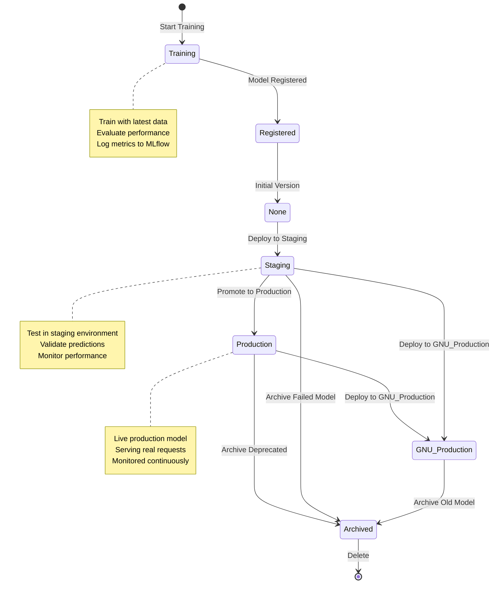
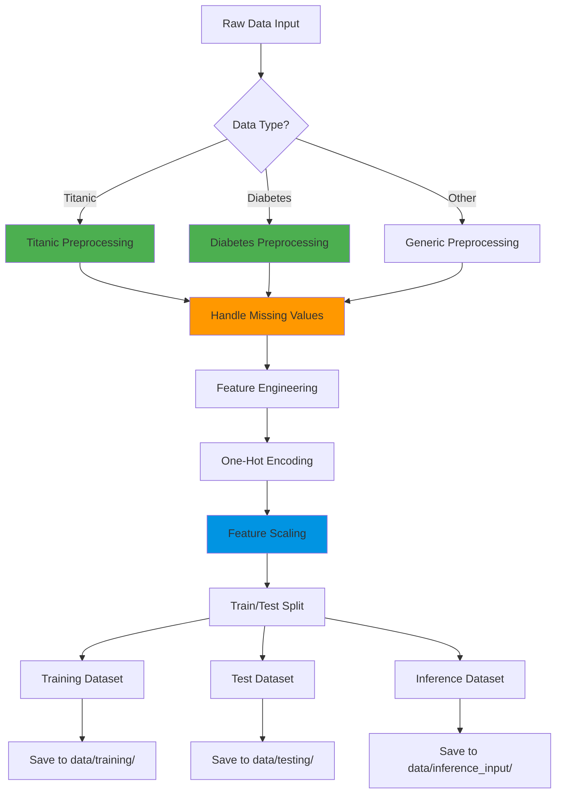

# GNU MLOps Pipeline - Architecture Diagrams

This document contains architecture diagrams for training, data flow, MLflow, and Databricks integration.

---

## 0. High-Level Architecture (System Overview)

---

## 1. Training Architecture

---

## 2. Data Flow Architecture

---

## 3. MLflow Architecture

---

## 4. Databricks Integration Architecture

---

## 5. Complete MLOps Pipeline Architecture

---

## 6. GitHub Actions CI/CD Pipeline

---

## 7. Model Lifecycle Management

---

## 8. Data Preprocessing Pipeline

---

## Usage Instructions

### For PowerPoint/Keynote:
1. Copy the Mermaid diagram code
2. Use online tools like:
   - [Mermaid Live Editor](https://mermaid.live/)
   - [Mermaid.ink](https://mermaid.ink/)
3. Export as PNG/SVG
4. Insert into your presentation

### For Markdown Presentations:
- Use tools like Marp, Reveal.js, or GitHub that support Mermaid natively

### For Documentation:
- These diagrams render automatically in GitHub, GitLab, and many documentation tools

---

## Diagram Descriptions

1. **Training Architecture**: Shows the complete training pipeline from data sources to model registry
2. **Data Flow Architecture**: Illustrates how data moves through the system
3. **MLflow Architecture**: Details MLflow components and storage backends
4. **Databricks Integration**: Shows how local and Databricks environments interact
5. **Complete MLOps Pipeline**: End-to-end view of the entire system
6. **GitHub Actions CI/CD**: Automated deployment pipeline
7. **Model Lifecycle Management**: State diagram of model stages
8. **Data Preprocessing Pipeline**: Data transformation workflow

