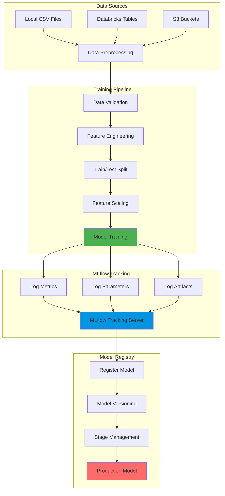
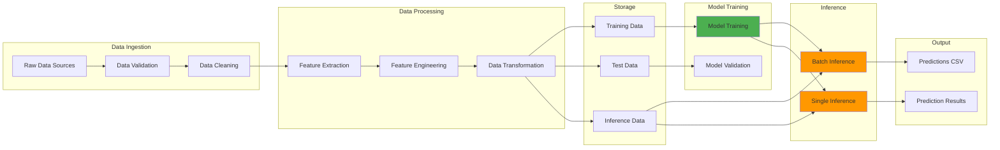
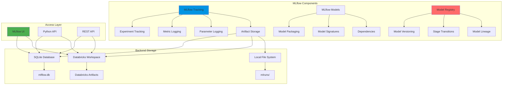
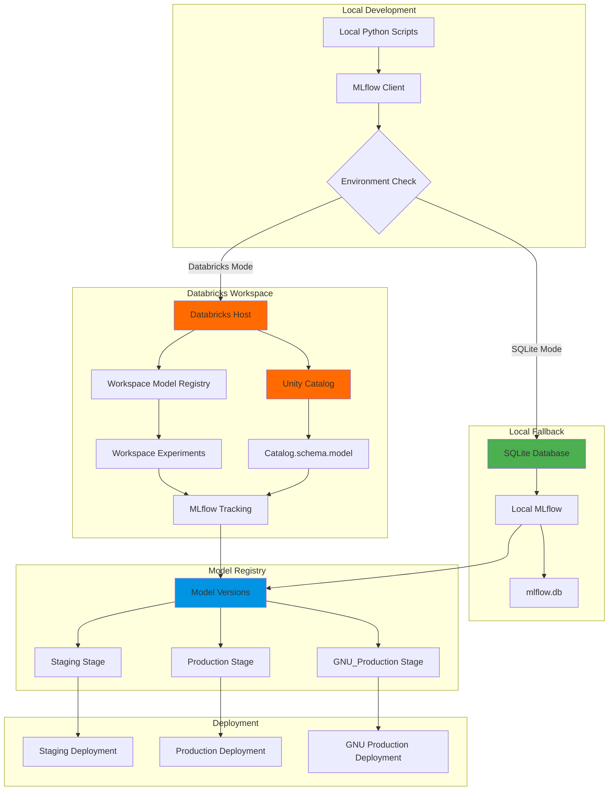

# Architecture Diagrams - Export Guide

This guide helps you export the architecture diagrams for use in PowerPoint presentations.

## Quick Export Methods

### Method 1: Mermaid Live Editor (Recommended)
1. Go to https://mermaid.live/
2. Copy the Mermaid code from `architecture_diagrams.md`
3. Paste into the editor
4. Click "Actions" → "Download PNG" or "Download SVG"
5. Insert into PowerPoint

### Method 2: Mermaid.ink API
Use this URL format to generate images:
```
https://mermaid.ink/img/<base64_encoded_mermaid_code>
```

### Method 3: VS Code Extension
1. Install "Markdown Preview Mermaid Support" extension
2. Open `architecture_diagrams.md`
3. Right-click on diagram → "Copy Image"
4. Paste into PowerPoint

### Method 4: Online Tools
- **Kroki.io**: https://kroki.io/
- **Mermaid Chart**: https://www.mermaidchart.com/
- **Draw.io**: Import Mermaid code

## Individual Diagram Files

For easier access, here are direct links to export each diagram:

### 1. Training Architecture


### 2. Data Flow Architecture


### 3. MLflow Architecture


### 4. Databricks Integration


## PowerPoint Tips

1. **High Resolution**: Export as SVG for best quality, then convert to PNG at 300 DPI
2. **Consistent Colors**: Use the color scheme from the diagrams:
   - Green (#4CAF50): Training/Processing
   - Blue (#0194E2): MLflow/Tracking
   - Red (#FF6B6B): Production/Registry
   - Orange (#FF9800): Inference
   - Purple (#9C27B0): Retraining
3. **Fonts**: Use monospace fonts for code/text diagrams
4. **Layout**: Keep diagrams simple and uncluttered for presentations

## Alternative: Use Text Diagrams

If Mermaid doesn't work, use the simple text diagrams from `architecture_diagrams_simple.txt`:
- Copy the ASCII art
- Paste into PowerPoint
- Format with monospace font (Courier New, Consolas)
- Add colors manually

