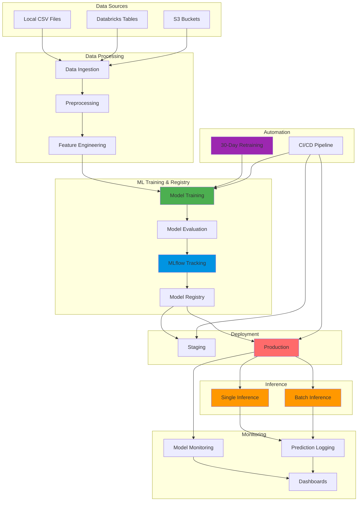

# GNU MLOps Pipeline - High-Level Architecture

This document provides a high-level overview of the entire GNU MLOps system architecture.

---

## System Overview

The GNU MLOps Pipeline is a comprehensive machine learning operations platform that automates the complete ML lifecycle from data ingestion to model deployment and monitoring.

---

## High-Level Architecture Diagram



---

## Component Breakdown

### 1. Data Layer
- **Purpose**: Ingest and prepare data for ML training
- **Components**:
  - Data sources (CSV, Databricks, S3)
  - Preprocessing scripts
  - Feature engineering
- **Output**: Clean, processed datasets ready for training

### 2. ML Training & Registry
- **Purpose**: Train models and manage versions
- **Components**:
  - Model training pipeline
  - Model evaluation
  - MLflow experiment tracking
  - Model registry with versioning
- **Output**: Registered model versions with metadata

### 3. Deployment Layer
- **Purpose**: Deploy models to different environments
- **Components**:
  - Staging environment (testing)
  - Production environment (live)
- **Output**: Deployed models ready for inference

### 4. Inference Services
- **Purpose**: Serve predictions to applications
- **Components**:
  - Single inference API (real-time)
  - Batch inference service (bulk processing)
- **Output**: Predictions for input data

### 5. Automation
- **Purpose**: Automate ML operations
- **Components**:
  - 30-day retraining scheduler
  - CI/CD pipeline (GitHub Actions)
- **Output**: Automated model updates and deployments

### 6. Monitoring
- **Purpose**: Track model performance and system health
- **Components**:
  - Model performance monitoring
  - Prediction logging
  - Operational dashboards
- **Output**: Insights and alerts

---

## Data Flow

```
Raw Data → Preprocessing → Training → Evaluation → Registry
                                                      ↓
                                              Deployment (Staging/Production)
                                                      ↓
                                              Inference (Single/Batch)
                                                      ↓
                                              Monitoring & Logging
```

---

## Technology Stack

| Layer | Technology |
|-------|-----------|
| **Data Storage** | CSV, SQLite, Databricks, S3 |
| **ML Framework** | Scikit-learn (RandomForest) |
| **MLOps Platform** | MLflow |
| **Model Registry** | MLflow Model Registry / Databricks Unity Catalog |
| **CI/CD** | GitHub Actions |
| **Scheduling** | Cron jobs / GitHub Actions |
| **Monitoring** | MLflow UI, Logs |

---

## Key Features

1. **Automated Training**: Scheduled retraining every 30 days
2. **Version Control**: Complete model versioning and lineage
3. **Multi-Environment**: Staging and production deployments
4. **Flexible Backend**: Works with SQLite (local) or Databricks (cloud)
5. **CI/CD Integration**: Automated testing and deployment
6. **Monitoring**: Real-time model performance tracking
7. **Batch & Real-time**: Supports both inference patterns

---

## Deployment Architecture

```
┌─────────────────────────────────────────────────────────┐
│                    Development                            │
│  Local → SQLite → MLflow UI → Test Deployments          │
└─────────────────────────────────────────────────────────┘
                        ↓
┌─────────────────────────────────────────────────────────┐
│                    Staging                                │
│  GitHub Actions → Train → Deploy Staging → Validate       │
└─────────────────────────────────────────────────────────┘
                        ↓
┌─────────────────────────────────────────────────────────┐
│                    Production                             │
│  Promote → Deploy Production → Monitor → Serve Requests   │
└─────────────────────────────────────────────────────────┘
```

---

## Integration Points

1. **Databricks**: Optional cloud backend for MLflow tracking and model registry
2. **GitHub Actions**: Automated CI/CD pipeline
3. **MLflow**: Central platform for experiment tracking and model management
4. **Local SQLite**: Fallback for offline development

---

## Scalability Considerations

- **Horizontal Scaling**: Batch inference can process multiple files in parallel
- **Vertical Scaling**: Model training can use more resources as needed
- **Cloud Integration**: Databricks provides unlimited scalability
- **Local Development**: SQLite allows offline development

---

## Security & Compliance

- **Credentials**: Stored in environment variables (never in code)
- **Model Lineage**: Complete audit trail of all model versions
- **Access Control**: MLflow and Databricks provide role-based access
- **Data Privacy**: Local processing option for sensitive data

---

## Next Steps

For detailed architecture of specific components, see:
- [Training Architecture](./architecture_diagrams.md#1-training-architecture)
- [Data Flow Architecture](./architecture_diagrams.md#2-data-flow-architecture)
- [MLflow Architecture](./architecture_diagrams.md#3-mlflow-architecture)
- [Databricks Integration](./architecture_diagrams.md#4-databricks-integration-architecture)

